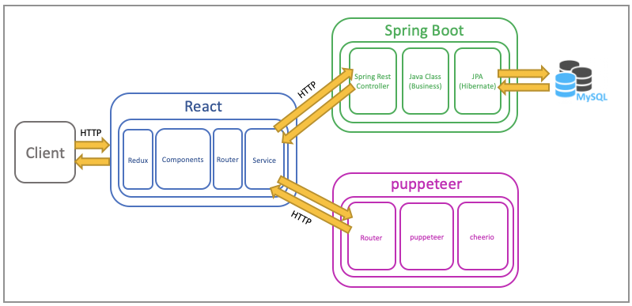

# webper / 2020 ECONOVATION 웹프로젝트

## 1. webper 

### 1-1. webper 서비스 소개

#### 관심있는 웹사이트를 drag & drop으로 간편하게 모아 보관할 수 있는 웹서비스

### 1-2. 팀 소개

> 팀원

- backend : 배종진

- frontend : 최진영

- frontend : 김서영

### 1-3. Project Convention

#### Commit Message Convention

- feat : 새로운 기능 추가
- fix : 버그 수정
- docs : 문서 수정
- style : 코드 포맷팅, 세미콜론 누락, 코드 변경이 없는 경우
- refactor : 코드 리펙토링
- test : 테스트 코드, 리펙토링 테스트 코드 추가
- chore : 빌드 업무 수정, 패키지 매니저 수정

### 1-4. 시스템 아키텍처

webper 서비스의 시스템 아키텍처는 아래와 같습니다.

### 1-5. Installation

준비중

### 1-6. 시연 영상

## 2. Front Layer

## 3. 인증 및 데이터 API 서버 (Spring Boot)

## 4. (pupeeteer 역할) 서버

